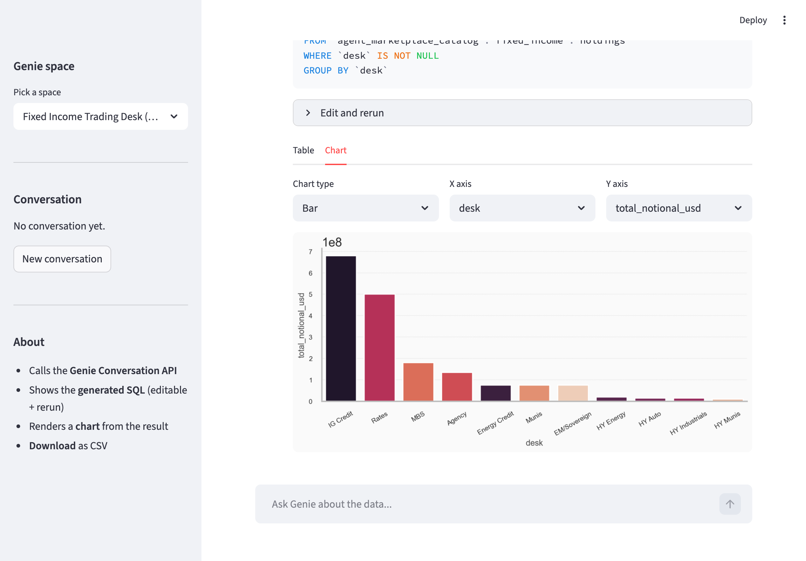

# TopGenie

A ~200-line Streamlit app on top of the [Databricks Genie Conversation API](https://docs.databricks.com/api/workspace/genie). Ask a Genie space a natural-language question and get back:

- the **generated SQL** (editable, with a "Rerun" button)
- the **result** as a table and an auto-picked chart (bar/line/area/scatter)
- a **Download CSV** button
- conversation continuity across follow-up turns

Deploys to [Databricks Apps](https://docs.databricks.com/dev-tools/databricks-apps/).



## Why

When a multi-agent supervisor calls a Genie space, or when you want to embed Genie answers inside a custom application, you lose Genie's UI (editable SQL, chart picker, downloads). The Conversation API returns enough to rebuild those affordances. TopGenie does it in one file.

Companion blog post: *TopGenie: Building a Custom Databricks App on the Genie Conversation API* (link).

## Quickstart

### 1. Clone

```bash
git clone https://github.com/philtief/genie-conversation-app.git
cd genie-conversation-app
```

### 2. Configure

Edit `app.yaml`:

```yaml
env:
  - name: GENIE_SPACE_ID
    value: "<your-genie-space-id>"
  - name: DATABRICKS_WAREHOUSE_ID
    value: "<your-warehouse-id>"
```

Get the space id from the Genie space URL: `.../genie/rooms/<space-id>?o=...`.

### 3. Run locally

```bash
uv venv
uv pip install -r requirements.txt
DATABRICKS_PROFILE=<your-cli-profile> \
GENIE_SPACE_ID=<id> DATABRICKS_WAREHOUSE_ID=<id> \
  .venv/bin/streamlit run app.py
```

Open http://localhost:8501.

### 4. Deploy to Databricks Apps

```bash
databricks apps create topgenie -p <profile>
databricks sync . /Workspace/Users/<you>/topgenie \
  --full --exclude .venv --exclude __pycache__ -p <profile>
databricks apps deploy topgenie \
  --source-code-path /Workspace/Users/<you>/topgenie -p <profile>
```

App URL appears in the `apps create` output. Logs at `<app-url>/logz`.

### 5. Grant the app's service principal access

The app runs as its own service principal. Without these grants the Conversation API returns 403:

```sql
-- Run on the warehouse you configured above
GRANT USE CATALOG ON CATALOG <catalog> TO `<app-sp-client-id>`;
GRANT USE SCHEMA  ON SCHEMA  <catalog>.<schema> TO `<app-sp-client-id>`;
GRANT SELECT     ON SCHEMA  <catalog>.<schema> TO `<app-sp-client-id>`;
```

Plus, in the workspace UI (or via the permissions API):

- Genie space &rarr; `CAN_RUN` for the app's service principal
- SQL warehouse &rarr; `CAN_USE` for the app's service principal

Get the SP client id from `databricks apps get topgenie`.

## How it works

The whole app is in [`app.py`](app.py). The Genie call returns a message with attachments; each `query` attachment carries the SQL, the warehouse id, a natural-language description, and an attachment id. A separate call fetches the result rows.

```python
from databricks.sdk import WorkspaceClient

w = WorkspaceClient()

msg = w.genie.start_conversation_and_wait(space_id=SPACE_ID, content=question)
qa = next(a for a in msg.attachments if a.query)

sql          = qa.query.query           # generated SQL
description  = qa.query.description     # NL summary
warehouse_id = w.genie.get_space(SPACE_ID).warehouse_id  # warehouse Genie uses

result = w.genie.get_message_attachment_query_result(
    space_id=SPACE_ID,
    conversation_id=msg.conversation_id,
    message_id=msg.message_id,
    attachment_id=qa.attachment_id,
).statement_response
```

The "Rerun edited SQL" button feeds the edited SQL into the [SQL Statement Execution API](https://docs.databricks.com/api/workspace/statementexecution) against the same warehouse, so governance and access controls are identical to Genie's own execution.

## Limits

- The API does not return chart specs. TopGenie picks a default with a small rule (numeric + categorical &rarr; bar; numeric over time &rarr; line; two numerics &rarr; scatter), then lets the user override.
- Results arrive synchronously up to a default chunk size (a few thousand rows). For larger results, page through the Statement Execution API after the first chunk.
- Clarification turns from Genie come back as text-only attachments (no `query`). TopGenie shows the text.

## Development

Lint with [ruff](https://docs.astral.sh/ruff/):

```bash
uvx ruff check .
uvx ruff check --fix .   # auto-fix
```

Configuration in [`pyproject.toml`](pyproject.toml).

## License

Apache 2.0. See [LICENSE](LICENSE).
