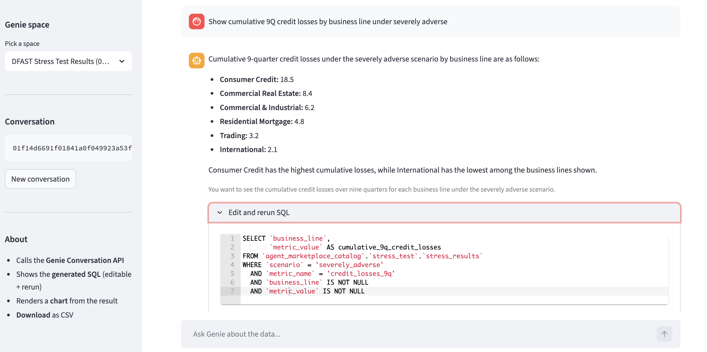
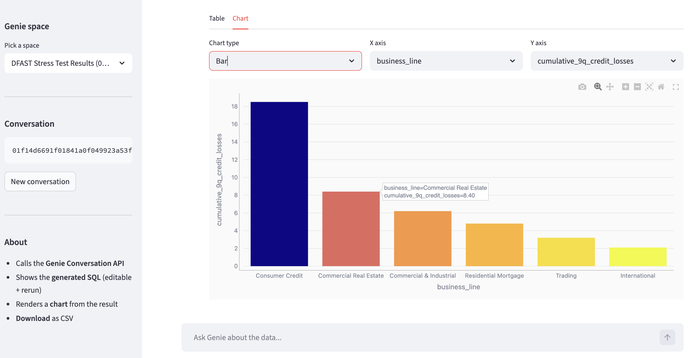

# TopGenie

A single-file Streamlit app on top of the [Databricks Genie Conversation API](https://docs.databricks.com/api/workspace/genie). Ask a Genie space a natural-language question and get back:

- the **generated SQL** (editable, with a "Rerun" button) &mdash; streamed into the UI the moment Genie produces it, before the warehouse finishes executing
- the **result** as a table and an auto-picked chart (bar/line/area/scatter)
- a **Download CSV** button
- conversation continuity across follow-up turns
- a **live progress indicator** with elapsed time and stage labels (`Genie is reading the schema...` &rarr; `Genie wrote the SQL, query running...` &rarr; `Loading rows...`)
- **two result-fetch modes** to bound app memory: *Inline + cap* (fast, truncated) and *External links* (full result via Arrow IPC, with automatic fallback to paginated inline when cloud-storage egress is blocked)
- per-turn **truncation warning** with one-click *Re-fetch with current cap* or *Load full via External Links*

Deploys to [Databricks Apps](https://docs.databricks.com/dev-tools/databricks-apps/).

### NL answer + color-coded SQL editor



### Interactive Plotly chart with hover tooltips



## Why

When a multi-agent supervisor calls a Genie space, or when you want to embed Genie answers inside a custom application, you lose Genie's UI (editable SQL, chart picker, downloads). The Conversation API returns enough to rebuild those affordances. TopGenie does it in one file.

Companion blog post: [**Databricks Genie Without the UI** &mdash; the Conversation API in three calls, a streaming trick that halves perceived latency, and a fallback for restricted-egress Databricks Apps](https://medium.com/@philipp.tiefenbacher_42173/databricks-genie-without-the-ui-a3066ea3d8ca).

## Quickstart

### 1. Clone

```bash
git clone https://github.com/philtief/genie-conversation-app.git
cd genie-conversation-app
```

### 2. Configure (optional)

By default the app lets the user **pick any Genie space they have access to** from a sidebar dropdown (powered by `WorkspaceClient.genie.list_spaces()`). No config needed to try it out.

To pin the app to a single space (e.g. for a customer-facing deployment), set `GENIE_SPACE_ID` in `app.yaml`:

```yaml
env:
  - name: GENIE_SPACE_ID
    value: "<your-genie-space-id>"   # optional; sidebar picker shows up if absent
  - name: DATABRICKS_WAREHOUSE_ID
    value: "<your-warehouse-id>"     # optional; falls back to the space's warehouse
```

Get the space id from the Genie space URL: `.../genie/rooms/<space-id>?o=...`.

### 3. Run locally

```bash
uv venv
uv pip install -r requirements.txt
DATABRICKS_PROFILE=<your-cli-profile> \
GENIE_SPACE_ID=<id> DATABRICKS_WAREHOUSE_ID=<id> \
  .venv/bin/streamlit run app.py
```

Open http://localhost:8501.

### 4. Deploy to Databricks Apps

```bash
databricks apps create topgenie -p <profile>
databricks sync . /Workspace/Users/<you>/topgenie \
  --full --exclude .venv --exclude __pycache__ -p <profile>
databricks apps deploy topgenie \
  --source-code-path /Workspace/Users/<you>/topgenie -p <profile>
```

App URL appears in the `apps create` output. Logs at `<app-url>/logz`.

### 5. Grant the app's service principal access

The app runs as its own service principal. Without these grants the Conversation API returns 403:

```sql
-- Run on the warehouse you configured above
GRANT USE CATALOG ON CATALOG <catalog> TO `<app-sp-client-id>`;
GRANT USE SCHEMA  ON SCHEMA  <catalog>.<schema> TO `<app-sp-client-id>`;
GRANT SELECT     ON SCHEMA  <catalog>.<schema> TO `<app-sp-client-id>`;
```

Plus, in the workspace UI (or via the permissions API):

- Genie space &rarr; `CAN_RUN` for the app's service principal
- SQL warehouse &rarr; `CAN_USE` for the app's service principal

Get the SP client id from `databricks apps get topgenie`.

## How it works

The whole app is in [`app.py`](app.py). The Genie call returns a message with attachments; each `query` attachment carries the SQL, the warehouse id, a natural-language description, and an attachment id. A separate call fetches the result rows.

```python
from databricks.sdk import WorkspaceClient

w = WorkspaceClient()

msg = w.genie.start_conversation_and_wait(space_id=SPACE_ID, content=question)
qa = next(a for a in msg.attachments if a.query)

sql          = qa.query.query           # generated SQL
description  = qa.query.description     # NL summary
warehouse_id = w.genie.get_space(SPACE_ID).warehouse_id  # warehouse Genie uses

result = w.genie.get_message_attachment_query_result(
    space_id=SPACE_ID,
    conversation_id=msg.conversation_id,
    message_id=msg.message_id,
    attachment_id=qa.attachment_id,
).statement_response
```

The "Rerun edited SQL" button feeds the edited SQL into the [SQL Statement Execution API](https://docs.databricks.com/api/workspace/statementexecution) against the same warehouse, so governance and access controls are identical to Genie's own execution.

## Troubleshooting

### `Genie returned status: FAILED`

The Conversation API accepted the question, generated SQL, and the warehouse rejected it. The app surfaces the underlying error block (NL explanation and the SQL Genie tried). Most failures fall into three buckets:

| Cause | How to confirm | Fix |
|-------|----------------|-----|
| App's service principal missing data grants | The SQL Genie tried references a table you have not granted to the SP | `GRANT USE SCHEMA ON SCHEMA <catalog>.<schema> TO \`<sp-client-id>\``, then `GRANT SELECT ON SCHEMA <catalog>.<schema> TO \`<sp-client-id>\`` |
| Question is off-schema for this space | Genie's NL response says it cannot find a relevant table | Switch space (sidebar dropdown) or rephrase to columns the space curates |
| Generated SQL hit a runtime error | Error block shows a SQL exception | Tail `<app-url>/logz` for the full warehouse error |

Find the app's SP client id with:

```bash
databricks apps get <app-name> --output json | jq -r '.service_principal_client_id'
```

Grant a fresh schema in one call from a notebook or `databricks api`:

```python
from databricks.sdk import WorkspaceClient
w = WorkspaceClient()
SP = "<sp-client-id>"
for stmt in [
    f"GRANT USE SCHEMA ON SCHEMA <catalog>.<schema> TO `{SP}`",
    f"GRANT SELECT     ON SCHEMA <catalog>.<schema> TO `{SP}`",
]:
    w.statement_execution.execute_statement(
        statement=stmt, warehouse_id="<warehouse-id>", wait_timeout="30s",
    )
```

### App shows "Pick a Genie space" on first load

The sidebar dropdown is empty because the SP has `CAN_RUN` on no spaces. Grant the SP `CAN_RUN` on at least one Genie space (Workspace UI > Genie space > Share, or via the permissions API).

### `App Not Available` (HTTP 502)

Streamlit-on-Databricks-Apps must listen on port `8000`. Verify `app.yaml` has `--server.port 8000` (it does in this repo, but worth re-checking after edits).

## Limits

- The API does not return chart specs. TopGenie picks a default with a small rule (numeric + categorical &rarr; bar; numeric over time &rarr; line; two numerics &rarr; scatter), then lets the user override.
- Inline results are capped at ~25 MB per chunk. For larger results, switch to **External links** in the sidebar's *Expert* expander, or click *Load full via External Links* on a truncated turn. If the app container cannot reach the presigned cloud-storage URLs (restricted-egress workspace), TopGenie falls back to paginated inline fetch through the control plane.
- Genie's [Agent Mode](https://docs.databricks.com/aws/en/genie/agent-mode#is-agent-mode-available-through-the-api) is in Public Preview and not yet exposed through the Conversation API. Every API call runs the standard single-step Genie path.
- Clarification turns from Genie come back as text-only attachments (no `query`). TopGenie shows the text.

## Development

Lint with [ruff](https://docs.astral.sh/ruff/):

```bash
uvx ruff check .
uvx ruff check --fix .   # auto-fix
```

Configuration in [`pyproject.toml`](pyproject.toml).

## License

Apache 2.0. See [LICENSE](LICENSE).
